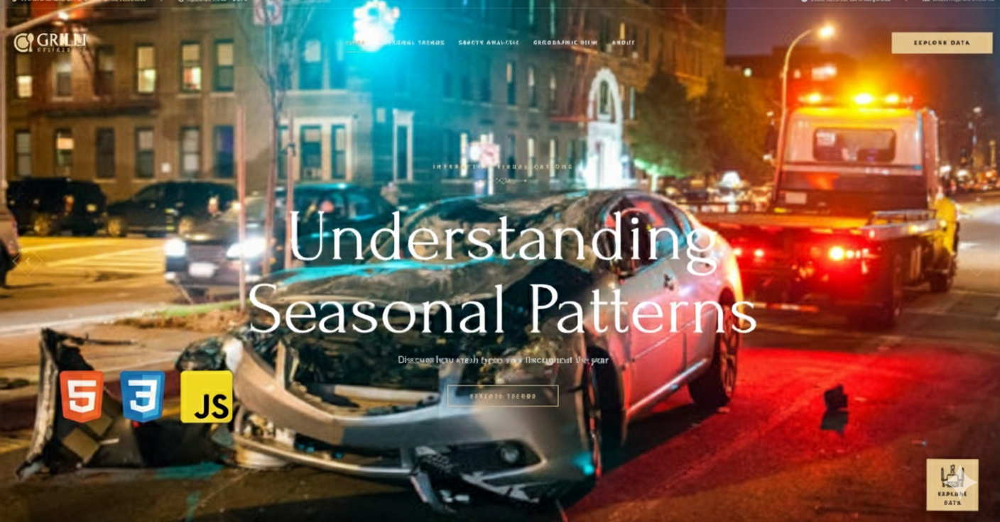

# Australia Road Safety Analysis Data Visualization

**Evidence-Based Safety Analysis Through Interactive Data Visualization**

An interactive data visualization website analyzing South Australia road crash and casualty data (2020-2024). Built on the Grilli restaurant template, repurposed for COS30045 Data Visualisation project at Swinburne University of Technology.

**[View Local Demo](https://cos30045-inti-subang.github.io/data-visualisation-project-dv_group25/)**

---

## Table of Contents

- [Project Overview](#project-overview)
- [Implementation Status](#implementation-status)
- [Technical Architecture](#technical-architecture)
- [Development Documentation](#development-documentation)
- [Dataset Information](#dataset-information)
- [Getting Started](#getting-started)
- [Project Structure](#project-structure)
- [Academic Requirements](#academic-requirements)
- [Contact](#contact)

---

## Project Overview


*Gemini Created Images*

This project transformed the original Grilli restaurant template from codewithsadee into an interactive data visualization platform for analyzing road safety data from Australia. The project maintains the original dark and gold aesthetic while replacing all content with data-driven insights and interactive charts to visualize the data effectively and efficiently with tooltips, on-hover animations, easy-to-view layouts, and more.

### Academic Context

- **Course:** COS30045 Data Visualisation
- **Institution:** Swinburne University of Technology
- **Dataset:** Australia Road Crash and Casualty Data (2020-2024)
- **Data Source:** [data.sa.gov.au](https://data.sa.gov.au)
- **Records Analyzed:** 63,241+ crash records, 23,894+ casualty records

### Tech Stack

- **Frontend:** HTML5, CSS3, Vanilla JavaScript
- **Visualization:** D3.js v7 + Observable Plot v0.6
- **Data Processing:** KNIME workflows
- **Development:** Live Server Extension (VS Code)
- **Design System:** CSS Custom Properties (dark theme + gold accents)
- **Version Control:** Git & GitHub

---

## Implementation Status

### Chart 1: Seasonal Crash Patterns (Line Chart) - COMPLETE

**Location:** `#line-chart` section
**Data Source:** `data/2020-2024_DATA_SA_Crash(filtered).csv` (15,471 rows)
**Research Question:** *"Is there a seasonal pattern to accidents?"*

**Visualization Details:**

- **X-Axis:** Months (January - December)
- **Y-Axis:** Average casualties per crash
- **Series:** 3 crash types compared (Rear End, Hit Fixed Object, Right Angle)
- **Colors:** Gold (primary theme), Silver, Orange-gold

**Interactive Features:**

- Year range filter (2020-2024 dropdowns)
- Crash type toggle checkboxes
- Reset filters button
- Enhanced tooltips with dark background and gold border
- Real-time chart updates
- Validation to prevent empty chart state

### Chart 2: Safety Equipment Analysis (Bar Chart) - COMPLETE

**Location:** `#bar-chart` section
**Data Source:** `data/2020-2024_DATA_SA_Casualty.csv` (23,894 rows)
**Research Question:** *"Does wearing a seatbelt reduce injury severity?"*

**Visualization Details:**

- **X-Axis:** Injury severity types (Fatal, Admitted to Hospital, Treated at Hospital, By Private)
- **Y-Axis:** Number of casualties
- **Comparison:** Side-by-side bars for "Fitted & Worn" vs "Not Fitted/Not Worn"
- **Colors:** Green (safe) vs Red (dangerous)

**Interactive Features:**

- Hover tooltips showing detailed counts
- Statistical summary panel with:
  - Total casualties by seatbelt status
  - Fatal rates comparison
  - Risk multiplier calculation

### Chart 3: Geographic Distribution (Map) - COMPLETE

**Location:** `#map` section
**Data Source:** Crash data with `ACCLOC_X`, `ACCLOC_Y` coordinates (2,000 crashes displayed)
**Research Question:** *"Where do most crashes occur in South Australia?"*

**Visualization Details:**

- **Technology:** Pure D3.js SVG rendering with zoom behavior
- **Map Type:** Scatter plot with coordinate system (GDA94 / MGA zone 54)
- **Markers:** Circle markers sized by casualty count (3-15px radius)
- **Color Coding by Severity:**
  - Red: Fatal crashes (1+ fatalities)
  - Orange: Serious injury crashes (1+ serious injuries)
  - Gold: Minor injury crashes (theme color)
  - Silver: Property damage only

**Interactive Features:**

- **Zoom & Pan:** `d3.zoom()` with 1x-10x scale range
- **Click Tooltips:** Display crash details including:
  - Crash type
  - Location (suburb/area)
  - Total casualties, fatalities, injuries
  - Weather conditions
  - DUI involvement
- **Background Grid:** Coordinate reference system at 10% opacity
- **Legend:** 4 severity categories with color indicators

---

## Development Documentation

### Errors Encountered & Solutions

#### Error 1: Preload Image Warning

**Problem:** Console warnings for preload links pointing to non-existent hero images
**Location:** `index.html` lines 43-45
**Error Message:** "Failed to load resource: net::ERR_FILE_NOT_FOUND"
**Solution:** Updated preload `<link>` tags to point to actual hero slider images.
**Status:** RESOLVED

#### Error 2: Empty Chart State in Line Chart

**Problem:** Chart would become empty if all crash types were unchecked
**Location:** `visualizations.js` updateLineChart() function
**Impact:** Poor user experience, confusing blank chart
**Solution:** Implemented validation to require at least one crash type selected.
**Status:** RESOLVED

#### Error 3: Bar Chart Initial Design Confusion

**Problem:** Original grouped bar chart grouped by seatbelt status, making injury severity comparison difficult
**Location:** `visualizations.js` renderBarChart() function
**User Feedback:** "Can you make it stand by each other with fitted and not fitted base on the type?"
**Solution:** Restructured chart to group by injury severity with side-by-side bars for fitted vs not fitted.
**Status:** RESOLVED

#### Error 4: Map Placement User Experience

**Problem:** Initial plan to place map at bottom of page would require annoying scrolling
**User Feedback:** "Don't put it at the bottom which is annoying to scroll down and see the map"
**Solution:** Positioned map section between Bar Chart and Key Insights sections.
**Status:** RESOLVED

#### Error 5: Map Technology Decision

**Problem:** Choice between Leaflet.js (easier) vs D3.js (more control)**Decision Process:**

- Leaflet.js: Simpler implementation, built-in map tiles
- D3.js: Full control, matches existing stack, custom styling
  **User Decision:** "We'll go with D3.js geo (more control, matches existing stack)"
  **Implementation:** Pure D3.js SVG approach with custom zoom/pan behavior.
  **Status:** IMPLEMENTED

#### Error 6: Map Performance with Large Dataset

**Problem:** 15,471 crash records could cause performance issues in browser
**Location:** `visualizations.js` createMap() function
**Solution:** Limited to 2,000 crashes for optimal performance.
**Status:** RESOLVED

#### Error 7: Summary Card Layout Typography

**Problem:** Summary card numbers and labels were misaligned and overflowing on smaller screens, breaking the visual hierarchy.
**Location:** `assets/css/style.css` (.summary-card, .summary-number)
**Solution:**

- Tightened `.data-summary-grid` with wider min columns and larger gaps.
- Updated `.summary-card` to align content from the top with extra spacing and minimum height.
- Implemented `clamp()` sizing for typography to ensure responsiveness.
  **Status:** RESOLVED

#### Error 8: Storytelling Approach Redundancy

**Problem:** The "Story Sidebar" approach was repetitive and took up too much vertical space, distracting from the visualizations.
**User Feedback:** "Remove the story sidebar, it's too repetitive."
**Solution:**

- Removed the sidebar layout.
- Retained and refined the "Summary Cards" to provide quick, digestible insights above each chart.
- Planned distinct storytelling strategies for each visualization type (Seasonal checkpoints for Line Chart, Comparison callouts for Bar Chart).
  **Status:** RESOLVED

---

## Dataset Information

### Primary Datasets

**1. Crash Data** (`2020-2024_DATA_SA_Crash(filtered).csv`)

- **Rows:** 15,471 (filtered in KNIME from 63,241 original)
- **Key Columns:**
  - Temporal: `Year`, `Month`, `Day`, `Time`, `DayNight`
  - Classification: `Crash Type` (Rear End, Hit Fixed Object, Right Angle, etc.)
  - Severity: `Total Fats`, `Total SI`, `Total MI`, `Total Cas`
  - Geographic: `ACCLOC_X`, `ACCLOC_Y`, `LGA Name`, `Suburb`, `Postcode`
  - Conditions: `Weather Cond`, `Road Surface`, `Area Speed`
  - Factors: `DUI Involved`, `Drugs Involved`

**2. Casualty Data** (`2020-2024_DATA_SA_Casualty.csv`)

- **Rows:** 23,894
- **Key Columns:**
  - Link: `REPORT_ID` (connects to crash data)
  - Demographics: `Casualty Type`, `Sex`, `AGE`
  - Injury: `Injury Extent` (Fatal, Admitted to Hospital, Treated at Hospital, By Private)
  - Safety: `Seat Belt`, `Helmet`, `Position In Veh`

### Data Processing

- **Tool:** KNIME Analytics Platform
- **Workflow:** Filtering, cleaning, column selection
- **Output Format:** CSV files for D3.js consumption
- **Coordinate System:** GDA94 / MGA zone 54 (South Australian standard)

**3. Queensland Crash Locations** (`_1_crash_locations.csv`)

- **Source:** [Queensland Government Data](https://www.data.qld.gov.au/dataset/crash-data-from-queensland-roads/resource/e88943c0-5968-4972-a15f-38e120d72ec0)
- **Usage:** Geographic map visualization reference data

---

## Getting Started

### Prerequisites

- **Git** - [Download Git](https://git-scm.com/downloads)
- **VS Code** - [Download VS Code](https://code.visualstudio.com/)
- **Live Server Extension** - Install from VS Code Extensions marketplace

### Run Locally

1. **Clone the repository:**

   ```bash
   git clone https://github.com/COS30045-Inti-Subang/data-visualisation-project-dv_group25.git
   cd data-visualisation-project-dv_group25
   ```
2. **Open in VS Code:**

   ```bash
   code .
   ```
3. **Start Live Server:**

   - Right-click on `index.html`
   - Select "Open with Live Server"
   - Or click "Go Live" button in VS Code status bar
4. **View in Browser:**

   - Navigate to `http://127.0.0.1:5500/index.html`
   - All charts will load automatically

---

## Project Structure

```
grilli/
├── index.html                          # Main page with all visualizations
├── assets/
│   ├── css/
│   │   └── style.css                   # Original 2143-line CSS (preserved)
│   ├── js/
│   │   ├── script.js                   # Original interactions
│   │   └── visualizations.js           # All D3/Plot chart code (792 lines)
│   └── images/                         # Hero slider images, shapes, icons
├── data/
│   ├── 2020-2024_DATA_SA_Crash(filtered).csv       # 15,471 rows
│   ├── 2020-2024_DATA_SA_Crash.csv                 # 63,241 rows (original)
│   └── 2020-2024_DATA_SA_Casualty.csv              # 23,894 rows
├── code_citations/
│   ├── CODE_CITATIONS.md               # GitHub Copilot usage disclosure
│   ├── Assignment_details.md           # Project requirements
│   └── ROAD_SAFETY_DATASET_GUIDE.md    # Data dictionary
├── .github/
│   └── copilot-instructions.md         # AI agent development guidelines
└── README.md                           # Project documentation
```

---

## Academic Requirements

### Assignment Deliverables Status

- [X] **Website hosted on local development server** - Live Server implemented
- [X] **Minimum 2 charts + 1 map visualization** - All 3 complete
- [X] **Interactive features** - Filtering, tooltips, zoom/pan implemented
- [X] **GitHub repository with version control** - Active repository
- [X] **GitHub Copilot usage disclosed** - Documented in `CODE_CITATIONS.md`
- [ ] **Design process book (PDF)** - In progress
- [ ] **KNIME workflow file (.knwf)** - To be finalized

### Academic Integrity

- [X] GitHub Copilot usage fully disclosed in `CODE_CITATIONS.md`
- [X] All external libraries properly attributed
- [X] Original implementation decisions documented
- [X] Progress tracked through incremental commits

---

## Resources & References

### Documentation

- [D3.js Documentation](https://d3js.org/)
- [Observable Plot Documentation](https://observablehq.com/plot/)
- [South Australia Data Portal](https://data.sa.gov.au)

### Original Template

- **Template:** Grilli Restaurant Website
- **Author:** codewithsadee
- **Source:** [GitHub Repository](https://github.com/codewithsadee/grilli)
- **License:** MIT

### Image & Video References

- ABC News. Texas crash image. [View Image](https://i.abcnewsfe.com/a/0af2a2f0-3e59-408a-b777-20b4fe81c121/texas-crash-01-ht-jt-231108_1699476775880_hpMain_16x9.jpg?w=992)
- NST. Malaysia crash scene (June 2025). [View Image](https://assets.nst.com.my/images/articles/060625nstcrash01_1749175662.jpg)
- FreeImages. Generic crash stock photo. [View Image](https://t4.ftcdn.net/jpg/01/77/70/23/360_F_177702320_r7v3wfRlbJNL56JBZvB2UkKpGO55xO0f.jpg)
- Road & Track. (2025). "Porsche 911 GT3 RS & BMW M2 collide in fiery crash at Nürburgring Nordschleife." [Read Article](https://www.roadandtrack.com/news/a65315930/porsche-911-gt3-rs-bmw-m2-collide-in-fiery-crash-nurburgring-nordschleife/)
- Hearst Autos. Porsche GT3 RS crash aftermath. [View Image](https://hips.hearstapps.com/hmg-prod/images/gt3-rs-686be24e5443a.jpg?crop=1.00xw:0.768xh;0,0.0376xh&resize=640:*)
- Reddit. Porsche accident footage (packaged media). [View Video](https://packaged-media.redd.it/fyx871fyfbbf1/pb/m2-res_1272p.mp4?m=DASHPlaylist.mpd&v=1&e=1762527600&s=c217157bcc718056374ac152ee52071e6856202a)
- Dexerto. (2025). Nürburgring crash documentation. [View Image](https://www.dexerto.com/cdn-image/wp-content/uploads/2025/07/07/nurbugring-crash.jpg?width=1200&quality=60&format=auto) (Accessed: 1 November 2025)
- Autoblog. Porsche-BMW Nürburgring collision scene. [View Image](https://www.autoblog.com/.image/c_fill,g_faces:center/NzowMDAwMDAwMDAwOTE3MTgw/porsche-911-gt3-rs-bmw-m2-nurburgring-crash-4.jpg)

---

## Contact

**Project Maintainer:** Jacob Jayen Pillai (Student ID: 105986053)
**Course Instructor:** COS30045 Teaching Staff
**Institution:** Swinburne University of Technology

For questions or feedback:

- Email: student@swin.edu.au
- GitHub: [Repository Issues](https://github.com/codewithsadee/grilli/issues)

---

## License

This project is licensed under the MIT License - see original template for details.

**Academic Use:** This is an educational project for COS30045 Data Visualisation unit.

---

<div align="center">

  **Built with 💛 using D3.js, Observable Plot, and the Grilli template**

  *Analyzing road safety data to make South Australia's roads safer*

</div>
